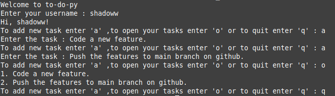

# TO-DO-PY

A to-do program created in python mainly for terminal.Still in initial stage adding new features as i learn more concepts and get more ideas.

## Problems

1. When open() is used and if the file doen't exist then it should create it but here it's giving FileNotFoundError so the two additional files are included with it.

